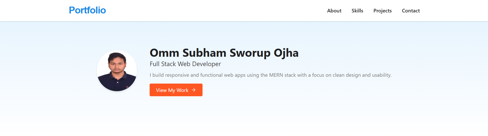
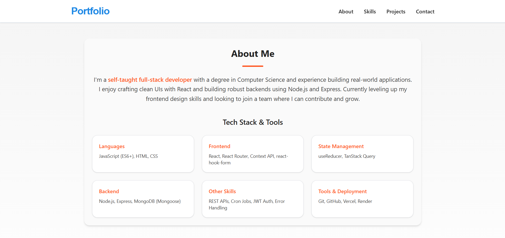
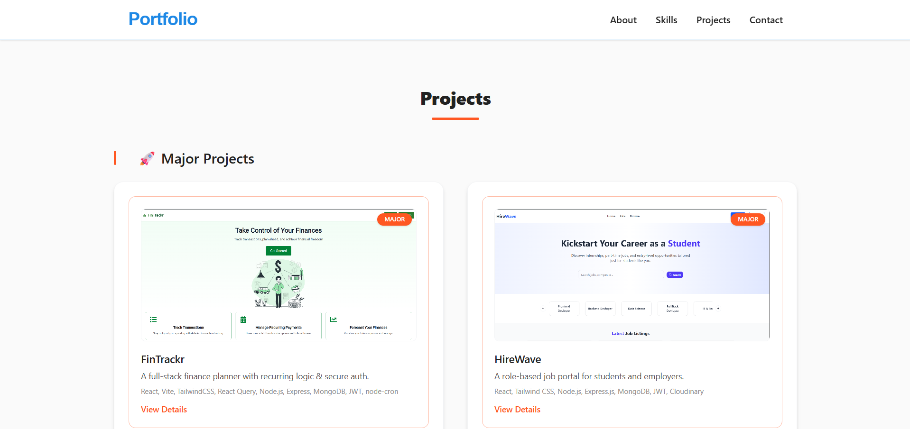

# 🧑‍💻 Personal Portfolio - Omm Subham Sworup Ojha

This is my personal portfolio website built using **React** and **Tailwind CSS**. It showcases my skills, projects, and background as a full-stack web developer.

Live Site 👉 https://portfolio-elze.onrender.com

---

## 📌 Features

- 💼 Clean, modern UI
- 📱 Fully responsive design
- 📸 Project showcase with images
- 📄 Resume download option
- 📬 Contact section with links to GitHub, LinkedIn, and Email

---

## 🚀 Tech Stack

- **Frontend**: React, Tailwind CSS
- **Icons**: React Icons
- **Deployment**: Render

---

## 🖼️ Screenshots





 

### Folder Structure

```
src/
├── components/
│   ├── Header.jsx
│   ├── Hero.jsx
│   ├── About.jsx
│   ├── Projects.jsx
│   ├── Contact.jsx
│   └── Footer.jsx
├── App.jsx
└── main.jsx

```

### Run Locally
```
git clone https://github.com/OSSworup/Portfolio
cd portfolio
npm install
npm run dev
```

### 📫 Contact
📧 Email: ossworupojha@gmail.com

🔗 LinkedIn: https://www.linkedin.com/in/omm-subham-sworup-ojha-b80144338/

